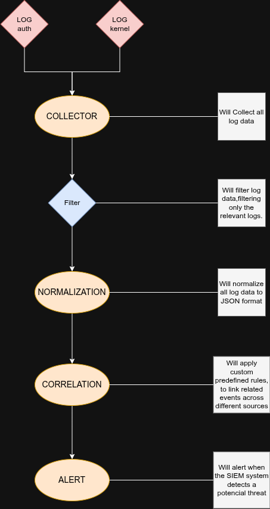

<div align="center">
    <h1>SIEM<br>(Security Information and Event Management)</h1>
</div>

<div align="center">
    A lightweight Security Information and Event Management (SIEM) prototype designed to collect, filter, and analyze Linux system logs to detect potential security threats or possible unwanted accesses.
</div>


<div align="center">
    <h3>Workflow Architecture</h3>
    
</div><br>


- The system follows a standard data processing pipeline:
    - <b>Collector:</b> Ingests raw log data from /var/log/.
    - <b>Filter:</b> Discards noise and extracts only security-relevant events.
    - <b>Normalization:</b> Converts unstructured log lines into standard JSON format.
    - <b>Correlation:</b> Links related events across different sources using predefined rules.
    - <b>Alerting:</b> Triggers notifications when potential threats are detected.


<div align="center">
    <h3>Normalization Example</h3>
</div>

The goal is to transform raw strings into actionable data:

<b>Raw Log:</b> ```2026-02-11T17:59:09.367691-03:00 L5450 unix_chkpwd[16169]: password check failed for user (vinas)```<br><br>
<b>Normalized JSON:</b>
```json
{
  "time": "2026-02-11 17:59:09",
  "source": "unix_chkpwd",
  "event": "Failed password",
  "host": "L5450",
  "user": "vinas"
}
```
